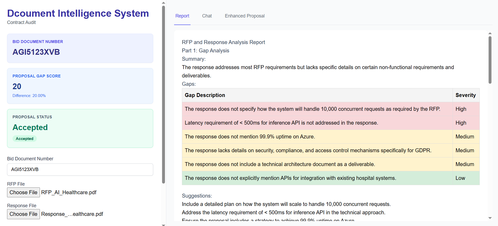
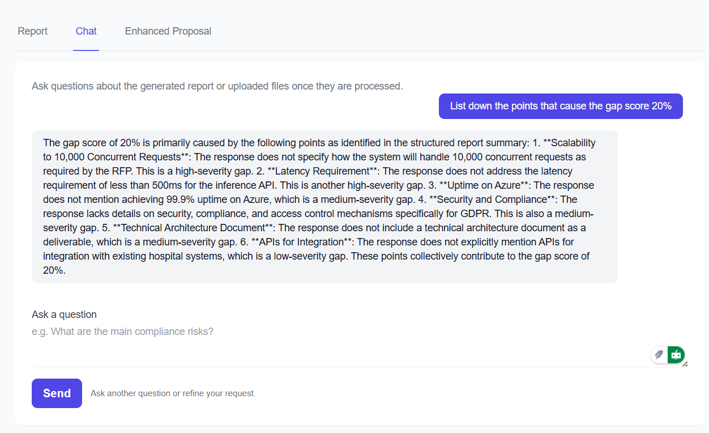
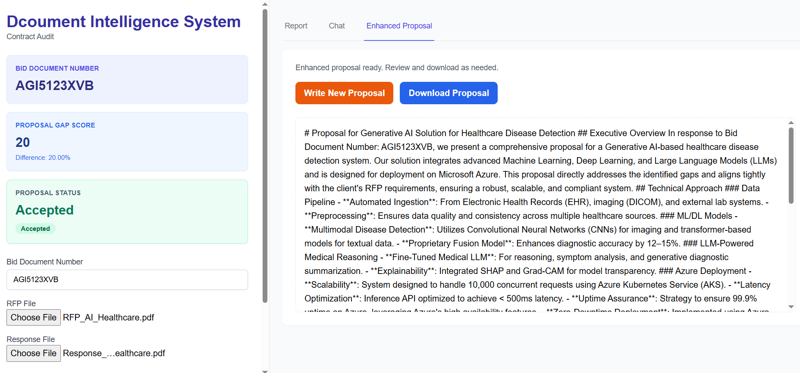

AI Document Intelligence System
Overview

ContractAudit is an AI-powered tool that automates the evaluation of Request for Proposal (RFP) documents and vendor responses.  The tool implements LlamaParse, FAISS, OCR, and Large Language Models (LLMs) to extract, compare, and assess contracts intelligently. It highlights gaps, generates scores, and produces detailed audit reports — reducing the manual effort and improving consistency in contract review.

Key Features

Intelligent Document Processing

Automated Scoring & Report Generation

Assigns a gap score to each proposal. Uses a threshold (e.g., > 20% discrepancy) to mark responses as Rejected or Accepted.

Analysis & Gap Detection:

LLM-based agents compare the RFP document and vendor response.

They identify missing or misaligned information (gaps) and categorize their severity (low, medium, high).

The system computes a gap score reflecting how well the proposal matches the RFP.

Chat System to talk with data:

Scoring & Decision Logic:

Based on the computed gap score, it applies configurable thresholds to decide whether a proposal is Accepted or Rejected.

Stores decision metadata to be shown in the report.

Report Generation:

After analysis, the system produces a structured HTML report.

The report includes an executive summary, requirement checklist, gap analysis, insights, and comparative evaluation.

Proposal Enhancement

Users can download this report for sharing and offline review.

Generates a comprehensive HTML report that includes:

Executive summary

Checklist of RFP requirements

Gap analysis breakdown

Key insights & trends

Comparative strengths of vendor responses

Provides downloadable reports for offline review and sharing.

Document Processing Layer:

Documents (RFPs and responses) are fed into LlamaParse to extract structured data (text blocks, tables).

For image-based documents, Tesseract OCR is used to extract text.

Parsed content is normalized and prepared for semantic indexing.

Semantic Indexing (FAISS):

Uses FAISS to build a vector index of parsed document content.

Embeddings (generated via LLM or embedding model) are stored to enable fast, semantic retrieval of RFP sections relevant to vendor responses.
Semantic Search & Gap Analysis

Indexes parsed documents using FAISS, enabling fast semantic retrieval.

Compares RFP requirements against vendor responses using LLM-based agents.

Detects and classifies “gaps” in responses (e.g., missing features, misalignment) and rates their severity (low, medium, high).
Supports uploading RFPs and vendor responses in a variety of formats (PDF, DOC, DOCX, image files).

Uses LlamaParse to parse structured content like tables, and Tesseract OCR for image-based text extraction.

Converts unstructured contract text into clean, analyzable representations.
